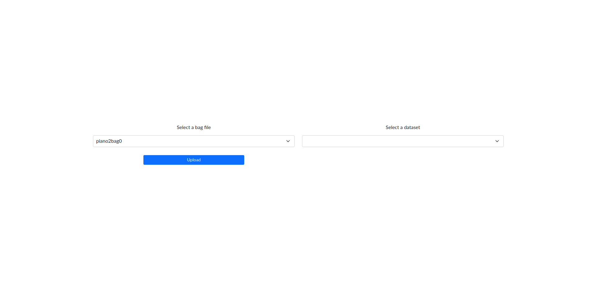
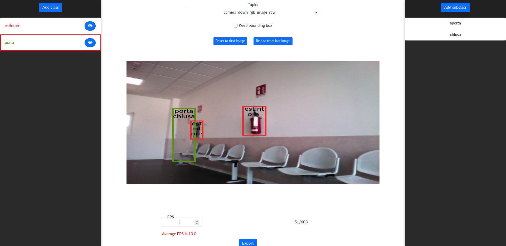

# Rosbag Data Annotator

- [Requirements](#requirements)
- [Installation](#installation)
- [Server startup](#server-startup)
- [Usage](#usage)

## Requirements

- Ubuntu ` 20.04`
- Node.js `>= 14.21`

## Installation

Download the source code and install the application.
Note that the `nmp start` command will install all the necessary dependencies (included ROS).
```bash
git clone https://github.com/aislabunimi/ros-data-annotator.git
cd ros-data-annotator
nmp start
nmp install
```

Once all dependencies are successfully installed, start the server to run the application
```bash
node src/server.js
```

## Usage

### Import or open an bagfile

The main page of the application allows you to import a new bagfile or open an existing one.

To load a bagfile for labelling, copy the file inside the `src/bag_file/` folder and then import it using the proper button.
This process simply copy the badfile into the database, saving all the messages in dedicated collection 
Once completed, you will be redirected to the labeling page.

If you want to open an existing dataset, you can select it using the list box on the right.



### Labelling interface

When you open an imported bagfile, you will be redirected to the following interface.



At first, you must select the topic to load the messages to label. You can do this by the list box on the top of the page.
When the first image is loaded, you can set the frequency to sample the messages from the selected topic using the textbox on bottom left of the page. 
To instantiate a new label, click the "Add class" button on the left (you can specify the label's name and the color of the bounding box).
If you wish to further enhance annotation precision, you can add a subclass (associated to a label) using the button "Add subclass" on the top of the right column.
Since two consecutive images can be similar, the bounding boxes of an image are copied in the next one by activating the "Keep bounding box".

To begin annotating objects, select the reference class and use the `Ctrl + left mouse click` combination to start drawing a rectangle that outlines the target object. 
Once created, a bounding box can be resized, moved, and deleted (using the `Canc` key).

To navigate to the next or previous image, you can use the `.` and `,` keys, respectively.

Through "Export" button you can select the topics to export to the `src/export/dataset_name/` folder.
